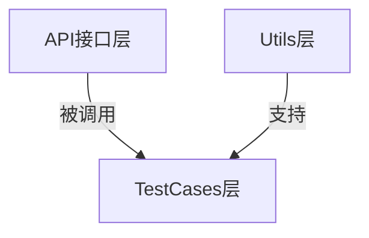

## 项目简介

本项目是一个开源的基于 **Java** 和 **RestAssured** 封装的API自动化测试框架Demo，具有以下特点：

✅ **实战验证**：参照此封装方式的框架已通过两家公司中大型项目验证  
✅ **兼容性强**：<span style="background:#ffeb3b;padding:2px 5px;border-radius:3px">基于JDK8编写，最低兼容JDK8</span>  
✅ **规范注释**：所有类和方法均参考Javadoc规范添加了注释，以便于理解各个类和方法的调用及执行逻辑  
✅ **开源协议**：遵循GNU Affero GPL v3.0及附加条款([查看详情](LICENSE))

### 注释示例

```java
/**
 * Token管理工具类
 * <p>
 * 提供添加和获取各个用户token的工具方法
 * </p>
 */
public class TokenManager {
    //存放用户token的HashMap集合，key：账号，value：token值
    public static Map<String, String> userToken = new HashMap<>();

    /**
     * 私有化构造函数，防止外部实例化
     */
    private TokenManager() {
    }

    /**
     * 添加token
     * <p>
     * 添加token的工具方法，往HashMap里面添加一个元素：{ 账号，该账号的token值 }。
     * 建议每次登录成功后都添加一个token，方便后续获取和使用
     * </p>
     *
     * @param username token所属的账号
     * @param token    该账号的token值
     */
    public static void addTokenToMap(String username, String token) {
        userToken.put(username, token);
    }

    /**
     * 获取token
     * <p>
     * 获取token的工具方法，根据传入的账号username，从HashMap里面获取一个账号的token值。
     * 在发起需要token鉴权的接口请求前，可根据该接口的业务场景，选择需要添加的账号的token作为请求头
     * （比如需要管理员权限，就传入一个管理员账号，获取该账号的token。前提是该管理员账号已调用过登录接口并添加到了存放token的HashMap集合中）
     * </p>
     *
     * @param username token所属的账号
     * @return 该账号的token
     */
    public static String getTokenFromMap(String username) {
        return userToken.get(username);
    }

}
```

## 项目结构

```bash
api-automated-testing/
|-- .idea
|-- docs
|   |-- image/    # README文档引用的图片
|-- src
|   |-- main    # 项目源码（测试框架项目，此目录一般为空目录）
|   |   |-- java
|   |   `-- resources
|   `-- test    # 测试框架源码目录
|       |-- java
|       |   `-- com
|       |       `-- stephen
|       |           |-- api    # 接口请求封装
|       |           |   |-- CheckUsernameAPI.java
|       |           |   |-- LoginAPI.java
|       |           |   `-- RegisterAPI.java
|       |           |-- testcases    # 测试用例
|       |           |   |-- TestLogin.java
|       |           |   `-- TestUser.java
|       |           `-- utils    # 工具包
|       |               |-- BaseTest.java    # 测试基类（提供给测试类继承）
|       |               |-- ConfigLoader.java    # 配置加载
|       |               |-- DBUtils.java    # 数据库管理工具类
|       |               |-- GetTestData.java    # 读取Excel测试数据
|       |               `-- TokenManager.java    # token管理
|       `-- resources    # 测试依赖资源
|           |-- TestData.xlsx    # 测试数据
|           |-- api-test-demo.jar    # 调试用的接口demo
|           |-- config.properties    # 项目配置（存放基准路径）
|           |-- jdbc.properties.template    # 数据库配置信息模板文件
|           `-- logback-test.xml    # 日志配置文件
|-- .gitignore
|-- LICENSE    # 许可证条款
|-- NOTICE    # 声明
|-- pom.xml    # Maven依赖管理
`-- testng.xml    # TestNG配置文件
```

## 

## 📜 许可证说明

> ⚠️ **重要法律声明**  
> 本项目受 **GNU Affero General Public License v3.0** 及附加条款约束：
> 
> - ✅ **允许**
>   
>   - 个人/企业自由下载、修改代码
>   
>   - 修改后部署到企业生产环境
>   
>   - 企业内部培训使用
> 
> - ❌ **禁止**
>   
>   - 包装成课程进行商业培训及售卖
> 
> - 💡 **建议**
>   
>   - 修改完善后的代码尽量开源分享
> 
> 📄 完整条款详见 [LICENSE 文件](LICENSE)

## 

## 前言

### 1. 开发初衷

***这是一个基于Java+RestAssured封装的API自动化测试框架Demo***，主要解决自动化测试工程师从Python转Java时的框架封装问题。旨在提供系统性封装教程，解决技术选型和封装实现难题。

### 2. 技术栈对比

| 作用            | Python   | Java                 |
| ------------- | -------- | -------------------- |
| **依赖管理**      | pip      | Maven                |
| **API测试框架**   | requests | RestAssured          |
| **单元测试框架**    | pytest   | TestNG               |
| **Excel数据处理** | openpyxl | Apache.poi           |
| **日志框架**      | logging  | logback              |
| **数据库连接**     | pymysql  | mysql-connector-java |

## 

## 🚀 快速启动指南

### 调试接口说明

项目包含本地可部署的接口Demo（约3MB），包含3个简单接口：

## API 文档

> 1、需要注意 使用http协议而不是https协议
> 
> 2、服务将在端口号4567上运行
> 
> 3、基准路径： `http://localhost:4567` 

### 1. 注册接口

- **URL**: `/register`

- **方法**: `POST`

- **参数**:
  
  - `username` (字符串): 用户名
  
  - `password` (字符串): 密码
  
  - `confirm_password` (字符串): 确认密码

- **成功响应**:
  
  ```json
  {"code": 200, "message": "注册成功"}
  ```

- **失败响应**:
  
  ```json
  {"code": 400, "message": "注册失败，密码不一致或用户名已存在"}
  ```

### 2. 登录接口

- **URL**: `/login`

- **方法**: `POST`

- **参数**:
  
  - `username` (字符串): 用户名
  
  - `password` (字符串): 密码

- **成功响应**:

```json
{"code": 200, "message": "登录成功", "data": "生成的token"}    
```

- **失败响应**:
  
  ```json
  {"code": 400, "message": "登录失败，用户名或密码错误"}
  ```

### 3. 查看当前账号接口

- **URL**: `/check-username`

- **方法**: `GET`

- **请求头**:
  
  - `auth`: 登录成功后返回的 token

- **成功响应**: 用户名 (字符串)

- **失败响应**: "用户未登录" (字符串)

> 📍 **Demo位置**：`src/test/resources/api-test-demo.jar`  
> 

#### 特点：

- ✅ **一键部署**：`java -jar` 即可运行（无需Tomcat/数据库）

- ⚠️ **数据临时性**：每次运行清空上次数据（需重新注册）

> **声明**：
> 
> - 此Demo为开源项目，无任何有害行为，Demo源码Github仓库：[Github: api-demo](https://github.com/StephenLeungs/api-demo)
> 
> - 可以直接使用resources目录下附带的jar包，也可以从仓库拉取或下载Demo源码，通过Maven打包获得jar包后参考下方启动方式部署

### 部署步骤

1. **启动API Demo**
   
   ```bash
   # 进入jar包目录
   cd src/test/resources/
   
   # 启动服务
   java -jar api-test-demo.jar
   ```
2) **运行测试**
   
   ```bash
   # 在项目根目录执行
   mvn test
   ```

## 

## 🧱 框架封装解析

### **封装结构**



相对于WebUI自动化测试框架而言，结构更简单，只有三层 

### 1. 核心组件

#### **api包**（接口请求层）

按照一个接口请求一个类的原则，封装RestAssured提供的API，构造请求：

```java
public class CheckUsernameAPI {
    //日志器 / Logger
    public static final Logger LOGGER = LoggerFactory.getLogger("CheckUsernameAPI.class");

    /**
     * 查询当前账号请求
     * <p>
     * 调用RestAssured相关方法，封装查询当前账号接口的请求
     * </p>
     *
     * @param username 要查询的账号（注意：该数据并非接口参数，而是需要此账号数据作为获取token的key）
     * @return 查询当前账号接口的响应文本
     */
    public String checkUsername(String username) {
        //初始化一个接口响应文本的String实例
        String checkUsernameResult = null;

        //根据传入的username，调用token管理工具类的获取token方法，获取该账号的token
        String token = TokenManager.getTokenFromMap(username);

        try {
            checkUsernameResult = given().
                    header("auth", token). //添加当前账号的token作为请求头
                            when().
                    get("/check-username").
                    then().
                    extract().response().asString();


        } catch (Exception e) {
            LOGGER.error("发起check-username请求异常异常 / check-username Request Error", e);
        }
        return checkUsernameResult;
    }
}
```

#### **utils包**（工具层）

封装配置加载、数据库管理、读取Excel文件测试数据、token管理等工具类：

```java
public class TokenManager {
    //存放用户token的HashMap集合，key：账号，value：token值
    public static Map<String, String> userToken = new HashMap<>();

    /**
     * 私有化构造函数，防止外部实例化
     */
    private TokenManager() {
    }

    /**
     * 添加token
     * <p>
     * 添加token的工具方法，往HashMap里面添加一个元素：{ 账号，该账号的token值 }。
     * 建议每次登录成功后都添加一个token，方便后续获取和使用
     * </p>
     *
     * @param username token所属的账号
     * @param token    该账号的token值
     */
    public static void addTokenToMap(String username, String token) {
        userToken.put(username, token);
    }

    /**
     * 获取token
     * <p>
     * 获取token的工具方法，根据传入的账号username，从HashMap里面获取一个账号的token值。
     * 在发起需要token鉴权的接口请求前，可根据该接口的业务场景，选择需要添加的账号的token作为请求头
     * （比如需要管理员权限，就传入一个管理员账号，获取该账号的token。前提是该管理员账号已调用过登录接口并添加到了存放token的HashMap集合中）
     * </p>
     *
     * @param username token所属的账号
     * @return 该账号的token
     */
    public static String getTokenFromMap(String username) {
        return userToken.get(username);
    }

}
```

> **注意**：如果需要调用DBUtils工具类连接数据库，需要在src/test/resources目录下的数据库连接信息模板文件jdbc.properties.template里填入自己的数据库连接信息，并把文件重命名为jdbc.properties

```properties
# JDBC driver class
jdbc.driver=com.mysql.cj.jdbc.Driver

# Database connection URL
# Replace {your_database_host}, {your_database_port} and {your_database_name} with your actual values
jdbc.url=jdbc:mysql://{your_database_host}:{your_database_port}/{your_database_name}?useUnicode=true&characterEncoding=utf8mb4&serverTimezone=Asia/Shanghai&useSSL=false&allowPublicKeyRetrieval=true

# Database username
jdbc.username={your_database_username}

# Database password
jdbc.password={your_database_password}
```

#### **testcases包**（业务层）

调用api包里构造的请求，使用TestNG DataProvider参数化测试：

```java
public class TestUser extends BaseTest {
    //日志器 / Logger
    public static final Logger LOGGER = LoggerFactory.getLogger("TestUser.class");

    /**
     * 查询当前账号接口测试用例
     * <p>
     * 用于测试查询当前账号接口，各个参数均由DataProvider读取Excel文件提供测试数据参数化传入
     * （@Test注解声明了所使用的DataProvider以及DataProvider所在的类）
     * </p>
     *
     * @param username       DataProvider读取到的账号测试数据（要查询的账号）
     * @param expectedResult DataProvider读取到的期望结果测试数据（用于断言）
     */
    @Test(groups = "User", priority = 3, dataProvider = "CheckUsernameData", dataProviderClass = GetTestData.class)
    public void testCheckUsername(String username, String expectedResult) {
        try {
            //调用查询当前账号接口类的实例方法checkUsername()发起请求，并对响应文本进行断言（要查询的账号 = 接口返回的账号）
            CheckUsernameAPI checkUsernameAPI = new CheckUsernameAPI();
            Assert.assertEquals(checkUsernameAPI.checkUsername(username), expectedResult);

        } catch (Exception e) {
            LOGGER.error("查询当前用户名测试用例异常/TestCheckUsername Testcase Error", e);
        }
    }

}
```

## 

## 🛠️ 辅助文件说明

| 文件                 | 作用                                                           |
| ------------------ | ------------------------------------------------------------ |
| `pom.xml`          | Maven依赖管理                                                    |
| `testng.xml`       | TestNG测试配置                                                   |
| `logback-test.xml` | 日志系统配置                                                       |
| `ConfigLoader类`    | 读取config配置文件中的配置                                             |
| `BaseTest类`        | 获取config配置文件中的api.base.url并设置为RestAssured的基准路径，作为父类，提供给测试类继承 |